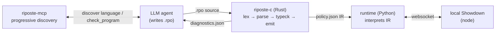

# Riposte

**A small declarative language for Pokémon battle policies — and an instrument for measuring
how you best teach an LLM a language it has never seen.**

A Riposte program compiles to a deterministic policy that plays real battles on
[Pokémon Showdown](https://github.com/smogon/pokemon-showdown) via
[poke-env](https://poke-env.readthedocs.io). No model has ever seen this language. That's the
point — it's a clean instrument for the question the project actually answers:

> **Given a language an LLM has never seen, which steering strategy best teaches an agent to
> write correct, competitive programs in it?**

Full design rationale is in [SPEC.md](./SPEC.md).

## Watch a model learn it

A real run: **Claude Opus 4.8, which has never seen Riposte**, was given one brief and the
`riposte-mcp` discovery tools. In **28 s** it walked the language grains, wrote a program,
compiled it **clean on the first try**, and won **49/50 vs `RandomPlayer`** — getting all four
quirks right.

```
language_overview() → list_topics() → get_topic(types_and_estimates) → get_topic(quirks)
→ … the grains … → predicate_reference(can_ko) → predicate_reference(outspeeds)
→ check_program(...)  ✓ 0 diagnostics
```

The exact program, the full tool-call transcript, and the compiled IR are in
[**`examples/agent_demo/`**](./examples/agent_demo/) — the clearest single view of what this
project is for.

## Why this is different from "LLM plays Pokémon"

Most work consults an LLM *every turn*. Here the LLM writes a policy **once**; execution is
deterministic and free. And the language is built to make cheating impossible at the type
level — battles are partially observable, so Riposte separates **facts** (what you truly know)
from **estimates** (opponent stats, unrevealed moves). You cannot write a program that peeks
at hidden state, and you cannot silently treat an estimate as certain — the compiler rejects
both. The interesting bugs are *semantic*: programs that compile and then lose. Those are
invisible to parse/execute metrics and central here.

## Architecture



The compiler emits a **versioned JSON policy IR**, not Python — codegen stays trivial,
artifacts are inspectable/diffable, and all semantic checking lives in the Rust front end
where the structured errors are. The eval framework drives an LLM agent (LangChain
`deepagents`) wired to the MCP server, and grades what it writes by **win rate over real
battles**.

## The language at a glance

```
bot "hazard_control" format gen9randombattle

on turn:
  rule escape_bad_matchup:
    when worst_case(opponent.active outspeeds my.active)
         and likely(can_ko(opponent.active, my.active))
         and exists bench b where resists(b, opponent.active.primary_type)
    do switch_to best bench by matchup_score(it, opponent.active)

  rule press_advantage:
    when likely(can_ko(my.active, opponent.active))
    do use strongest_move against opponent.active

  otherwise:
    do use strongest_move against opponent.active
```

### The four deliberate quirks — the measurement instrument

These are correct-but-unfamiliar choices. An agent that reads the steering gets them right;
one pattern-matching from internet Pokémon knowledge gets them wrong in ways that compile and
lose.

| Quirk | Rule | Enforced by |
|-------|------|-------------|
| **Q1 fractions** | all HP/damage are fractions in `[0,1]` — no raw HP anywhere | — |
| **Q2 categorical effectiveness** | `effectiveness(m,d) at_least super`, never `> 2` | **E032** |
| **Q3 rule order = priority** | first true `when` wins; no scores, no weights | — |
| **Q4 mandatory resolvers** | an estimate comparison is a `tribool`; resolve with exactly one of `likely`/`worst_case`/`best_case` | **E030** (missing) / **E031** (redundant) |

## What's built

| Component | Status |
|-----------|--------|
| **Compiler** `riposte-c` (Rust) — lexer, recursive-descent parser + recovery, AST, `GRAMMAR.ebnf`, epistemic type system, IR emit, `diag.json` | ✅ M1+M2 |
| **Runtime** `riposte-rt` (Python) — IR interpreter, gen-9 damage calc, poke-env `RipostePlayer` | ✅ M0+M2 |
| **MCP server** `riposte-mcp` — progressive language discovery (`get_topic`, `predicate_reference`, `explain_error`, `check_program`) | ✅ |
| **Eval framework** `evalkit` — async-parallel Gherkin runner over a `deepagents`+MCP agent; grades compile-pass, win rate vs baselines, quirk budget | ✅ |
| **C1–C4 × models × k-task matrix** — first real result ([`writeup/findings.md`](./writeup/findings.md)): *a repair loop dominates the delivery channel; docs-dump + repair is the cost-efficient sweet spot* | ✅ |
| Larger task set + eval-learnings blog | ⏳ next |

## Repo layout

| Path | What lives here |
|------|-----------------|
| `compiler/` | Rust workspace: `diagnostics`, `lexer`, `ast`, `parser`, `typeck`, `emit`, `riposte-c` (CLI). |
| `runtime/` | `riposte_rt`: IR schema, predicates, damage calc, interpreter, poke-env player. |
| `mcp/` | `riposte-mcp` server. |
| `steering/` | Language docs in grains — the single source for both a docs-dump and the MCP tools. |
| `predicates.toml` | Shared predicate signatures (Rust typeck ↔ Python runtime; can't drift). |
| `evalkit/` | Generic eval framework (no Riposte imports) — Gherkin runner, agent driver, CLI. |
| `evals/` | Riposte step defs, baselines, `.feature` task briefs. |
| `examples/` | Example `.rpo` programs + the agent demo. |

## Quickstart

```bash
# 1. compiler
cargo build --manifest-path compiler/Cargo.toml
compiler/target/debug/riposte-c build examples/hazard_control.rpo --stdout   # → policy.json

# 2. runtime + local Showdown (pinned commit in .showdown-commit)
#    play a hand-written policy vs RandomPlayer
cd pokemon-showdown && node pokemon-showdown start --no-security &   # terminal 1
cd runtime && uv venv && uv pip install -e ".[dev]" && cd ..
python scripts/m0_gate.py --n 100                                    # ≈99% vs Random

# 3. run the evals (stub agent — no API key needed)
pip install -e evalkit -e evals
evalkit run evals/features/hazard_control.feature --steps riposte_evals.steps \
  --driver stub --stub-source examples/hazard_control.rpo
```

To run a **live** agent, `pip install -e "evalkit[agent]"`, set `ANTHROPIC_API_KEY`, and use
`--driver deepagents --mcp-cmd riposte-mcp`.

See [SPEC.md §9](./SPEC.md) for milestones M0–M5.
